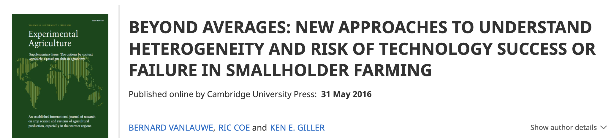
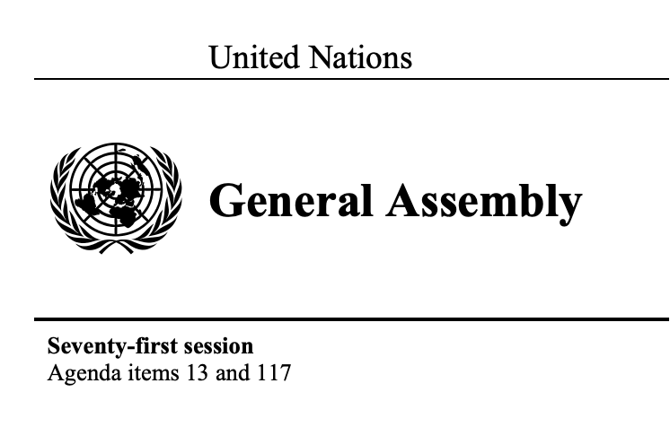
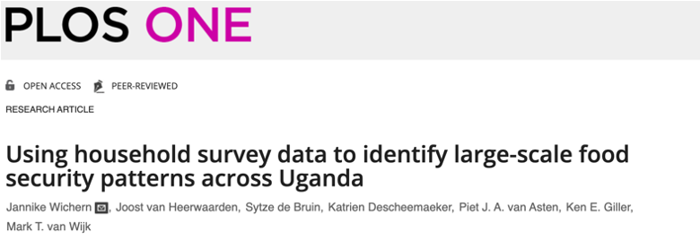
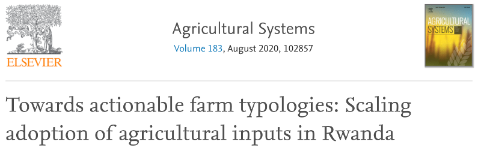
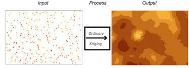
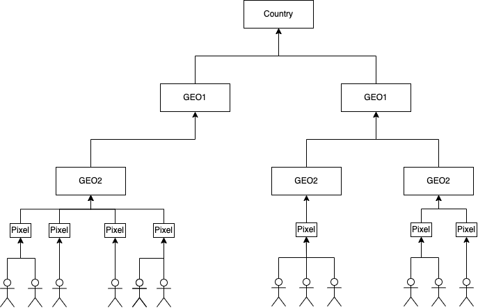
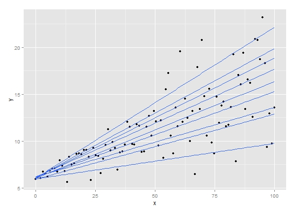
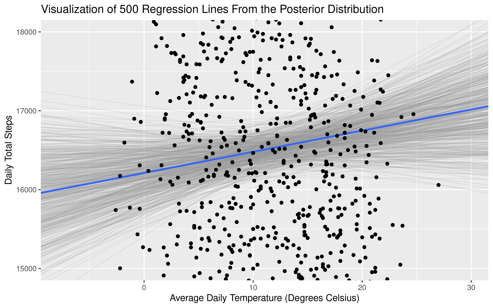

```{r setup, include=FALSE}

knitr::opts_chunk$set(echo = TRUE)

```

# Why Is Heterogeneity Important? 

<h3>TLDR</h3>

* Different impacts for different locations
* Targeting is more sought after
* Maps being produced in the name of targeting


## Why Is Heterogeneity Important? 

<div class="container">

<div class="col quote-box">
<small>"In recent years, many studies have demonstrated the heterogeneity of the smallholder production environment. Yet agronomic research for development (R4D) that aims to identify and test options for increasing productivity has not consistently adapted its approaches to such heterogeneous conditions."
</small>


</div>


<div class="col">
  {width=400px}
</div>
</div>


<aside class="notes">

* Why to we care about heterogeneity in AR4D
* This Vanlauwe article talks about, labs, then in field stations. 
* Some work well, some bad. 
* Interest in divers
* Explore diff not bulldoze over.
* So one of the premises is "we need to do research to better understand why interventions work better in one place than another". Then we can do interesting things like try to predict where they will work well


</aside>

## Why is Heterogeneity Important

<div class="container">

<div class="col">
<small>"IFAD’s comparative advantage lies in its targeting of the poorest, the poor and the vulnerable peoples and those who are most likely to have little access to assets and opportunities due to social exclusion and marginalization"
</small>

<small><i>Article 5</i></small>


</div>

<div class="col">
  {width=400px}
</div>
</div>

<aside class="notes">

* The Vanlauwe article focused on productivity interventions. 
* A big thing in development is targeting the "poorest of the poor", or those most in need
* While not explicitly stated, this is a question of capturing farmer heterogeneity.
* We need to know, who is poor? where are they? What works best for them?
* There is widespread acknowledgement that differentiation, targetting, and capturing heterogeneity are important

</aside>


## Why do We Care? 

<div class="container">

<div class="col">
<small>"… Member States indicated that they will seek to increase and use high-quality, timely and reliable data disaggregated by sex, age, geography, income, race, ethnicity, migratory status, disability and other characteristics relevant in national contexts"
</small>

<small><i>General Assembly resolution 69/313</i></small>

<!-- <div class="quote-container"> -->
<!-- <small class="d-flex justify-content-end">sezdrgfsezrsfd</small> -->
<!-- </div> -->

</div>

<div class="col">
  {width=400px}
</div>
</div>

<aside class="notes">

* For example, the UN have stated that member states will need to use more and more disaggregated data to inform their decision making
* Following the resolution, the UN have set up a group working on small area estimation toolkits to further disaggregate maps and indicators they produce.

</aside>

## We Measure Heterogeneity in Different Ways


{width=400px}
{width=600px}
<aside class="notes">

* We are going to talk about heterogeneity
* Quality of being diverse in characteristics
* Not single characterist
* systematic review looking at heterogeneity
* In short, heterogeneity in smallholder farms can capture their diverse characteristics at the household level (demographics, farm practices...), as well as higher levels (their environment, their landscape, their county...)

</aside>


## Heterogeneity and Targetting 

<div class="container">

<div class="col quote-box">
<small>"To target food security interventions for smallholder households, decision makers need large-scale information, such as <strong>maps on poverty, food security and key livelihood activities"</strong>
</small>

<!-- <div class="quote-container"> -->
<!-- <small class="d-flex justify-content-end">sezdrgfsezrsfd</small> -->
<!-- </div> -->

</div>


<div class="col">
  {width=400px}
</div>
</div>

<aside class="notes">

* This acknowledgement that making sense of heterogeneity can help us make informed decisions and target resources is quite common in research, and we have done it ourselves. 
* I'll  go through these articles in a second, but it just shows that mapping efforts, clustering... all try to capture the differences between farmers in the name of targetting!

</aside>


## Heterogeneity and Targetting 

<div class="container">

<div class="col quote-box">
<small>"...(farm size) estimates help inform agricultural development strategies, although the estimates are limited by the data available."
</small>


</div>


<div class="col">
  {width=400px}
</div>
</div>

## Heterogeneity and Targetting 

<div class="container">

<div class="col quote-box">
<small>"This practice is for the purpose of identifying an agricultural technology or other development intervention which might benefit one type but not another – for the “targeting” of agricultural innovations"
</small>


</div>


<div class="col">
  {width=400px}
</div>
</div>

# Methods to Capture Heterogeneity

<h3>TLDR</h3>

Methods currently use often do not currently capture:

* Spatial/Contextual drivers
* Distribution of responses
* Uncertainty

<aside class="notes">

* It was confirmed that this was the case during the systematic review


</aside>

## Indirect Estimation 

<small>Using two or more known variables to 
estimate your target</small>

{width=400px}
  
<div class="flex-container">
<div class="col">

<h5>Advantages</h5>

<small>
<ul>
<li> Can produce estimates with large coverage  </li>
<li> Intuitive </li>
</ul>
</small>
</div>
<div class="col">

<h5>Disadvantages</h5>

<small>
<ul>
<li> Need assumptions about distribution of target </li>
<li> Limited to known close associations </li>
<li> Can reinforce existing assumptions when incorrect </li>
</ul>
</small>
</div>

</div>

<aside class="notes">

* So how do we go about capturing heterogeneity within smallholders
* Here it is useful to take some of the laguage form smallarea estimation. A field which looks at mapping and disaggregating data
* The first method we will look at is the indirect estimate. This is where we have two or more known characteristics which are definite, and we use it to infer a third. In the case of the Lowder article, they took the mean arable land and the number of farmers and used this to calculate average farm size.
* But what are the advantages and disadvantages

</aside>

## Household Level Estimates

<small>Using associations between household and/or
environmental characteristics to predict
household level outcomes</small>

{width=400px}
  
<div class="flex-container">
<div class="col">

<h5>Advantages</h5>

<small>
<ul>
<li> Can show drivers when explainable methods are used  </li>
<li> Can generate estimates with uncertainty </li>
</ul>
</small>
</div>
<div class="col">

<h5>Disadvantages</h5>

<small>
<ul>
<li> Until now, assumptions made about distribution </li>
<li> Outliers and significant local heterogeneity make it difficult to identify largescale variations </li>

</ul>
</small>
</div>

</div>

<aside class="notes">

* In household level, or unit level, estimates.
* We build a model correlating the characteristic we are interested in, with other data which is more widely available, and has more coverage.
* For example, we may have association between age, education level and income. We could try to build a regression model and try to predict income in households where we don't have income data, but we do have data on education and income data.


</aside>

## Area Level Estimates

<small>Using associations between spatial indicators to predict
a statistic for an "area"</small>

{width=400px}
  
<div class="flex-container">
<div class="col">

<h5>Advantages</h5>

<small>
<ul>
<li> Can draw on data with large spatial coverage </li>
</ul>
</small>
</div>
<div class="col">

<h5>Disadvantages</h5>

<small>
<ul>
<li> Difficult to validate in applied setting </li>
<li> Local level heterogeneity often dominates </li>
<li> Obsession with the mean </li>
</ul>
</small>
</div>
</div>


<aside class="notes">

* Area level estimates.
* We build a model correlating the characteristic we are interested in, again with other data which is more widely available, and has more coverage.
* For example, we may have association between the intensity of night lights in a given area (a proxy for electrification), and the poverty levels of that village. We could try to build a regression model and try to predict 


</aside>

## Clustering

<small>Identifying typologies by identifying 
multi-dimensional similarities</small>

{width=400px}
  
<div class="flex-container">
<div class="col">

<h5>Advantages</h5>

<small>
<ul>
<li> Could be used for intuitive groupings for field work </li>
<li> Flexible for manageable groupings </li>

</ul>
</small>
</div>
<div class="col">

<h5>Disadvantages</h5>

<small>
<ul>
<li> Focuses on single level similarities </li>
<li> Difficult to transfer </li>
<li> Interpretation of clusters could be subject to bias </li>
<li> In heterogeneous environments the "tightness" of the clusters can be questionable </li>

</ul>
</small>
</div>
</div>


<aside class="notes">

* This can be useful for categorising groups which have very complex characteristics.
* For example, you may want to understand how likely a household is to take up a particular intervention based on a 
* This has almost become a bit of a procedure for targetting, with a range of articles following the same method.

</aside>

## Interpolation

<small>Smoothing between points to 
"fill in the gaps"</small>

{width=400px}


<div class="flex-container">
<div class="col">

<h5>Advantages</h5>

<small>
<ul>
<li> Intuitive </li>
<li> Can lead to predictions with large spatial coverage </li>
<li> Easy to transfer to temporal interpolations </li>

</ul>
</small>
</div>
<div class="col">

<h5>Disadvantages</h5>

<small>
<ul>
<li> Cannot deal with stepwise changes </li>
<li> Large uncertainties with patchy </li>
<li> No real explanation of the spatial variation </li>

</ul>
</small>
</div>
</div>


<aside class="notes">

* Essentially smoothing. Can be useful when you have small gaps in your data, or combined with other methods 

</aside>

# What are we really trying to answer?


<div class="flex-container">

<div class="col">
<h5>Which farmers?</h5>
<small>
<ul>
<li> Demographic groups </li>
<li> Wealth quartiles </li>
<li> Practices </li>
</ul>
</small>
</div>

<div class="col">
<h5>Exist where?</h5>
<small>
<ul>
<li> Villages </li>
<li> Subnational units </li>
<li> Agro-ecological zones </li>
</ul>
</small>
</div>
</div>

To understand this, in the context of the "poorest of the poor", we need to understand at which
levels variablility is "most important"


## Issues with Current Methods

In each of the approaches there are assumptions about:

* At which level heterogeneity is most relevant/dominates
* Which level of heterogeneity is most useful to policy makers
* The distribution of outcome variables (mean correlated with need for assistance.)

<aside class="notes">

* Many of these methods presume importance on particular variables (or levels)
* Almost no differentiation between types of farmers


</aside>

# Proposed work

**An exploration of multi-level heterogeneity**
Some questions to consider:

1. What is the distribution of characteristic X in sub national location Y?
2. What are the household level drivers of heterogeneity?
3. What are the spatial drivers of heterogeneity?
4. Are these drivers the same for all farm types?

Then... if we can demonstrate that there are strong
spatial drivers, then we can attempt to "fill in the gaps"

## Data

Data from 9 countries


<div class="flex-container">


<div class="col">
<small>
<ul>
<li>Household level: RHoMIS (Farm practices, incomes, gender information)</li>
<li>Spatial (Pixel Level): MODIS derived (Climate information, land cover...)</li>
<li>Sub-national: IPUMS (Education levels, asset ownership, electrification...)</li>
</ul>
</small>
</div>

<div class="col">

{width=500px}
</div>
</div>

## Data 

{width=500px}


## Suggested Approach: Layering Methods

<div class="flex-container">

<div class="col">
Quantile Regression
{width=300px}
{width=300px}
</div>

<div class="col">
Multi-Level Models
{width=400px}
</div>


<div class="col">
Bayesian Methods
{width=400px}
</div>
</div>


## What about Project Bias


{width=500px}


Bootstrapping!

# Summary 

* Mapping farmers could be important for targeting but we need to know what we are targetting
* To map farmers we need to understand how characteristics vary across different scales
* Only after we understand which types of heterogeneity dominate, can we begin to think about what what predictions we can make

## Questions

* For linear quantile mixed models, how do we differentiate between quantiles within and overall quantiles
* Procedures for variable selection?


