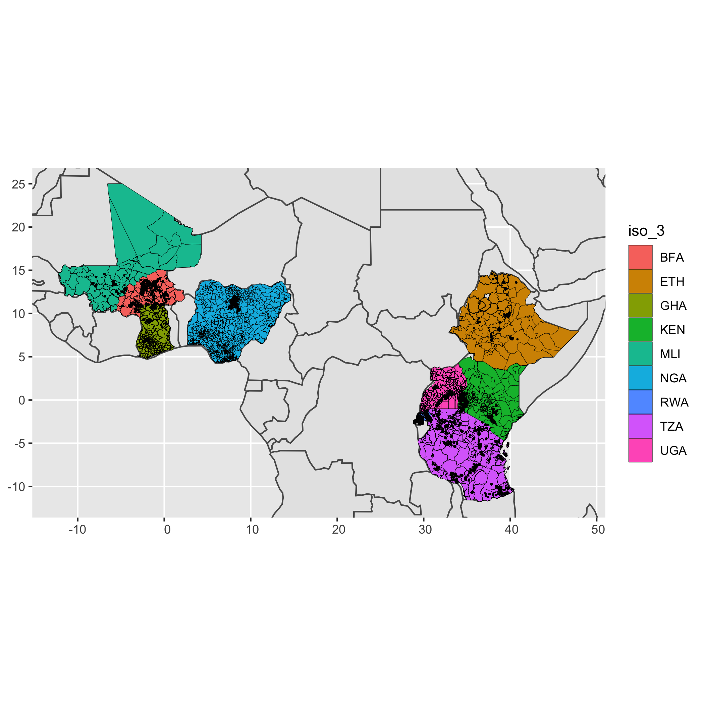

## Primary Questions Are

* Are there differences between locations in mean land size?
* Is land-size important for determining food security or incomes?
* How much does land size vary in one single location?
* Does predicting the mean, or the median actually tell us anything?
* Can we interactively plot the marginal distribution of land-size, given parameters in a given location?
* If so, can we combine this with census data to answer the question: _based on the data we have, we think there are N farmers with farm-sizes under X ha, with confidence y_
* How would we validate such a model?


```{r setup, warning=F, message=FALSE,  echo=F}
knitr::opts_chunk$set(warning = FALSE, message = FALSE) 
# Data Processing Packages
library(jsonlite)
library(readr)
library(dplyr)
library(tibble)
library(rlang)

# Spatial Packages
library(sf)
library(sp)
library(stars)

# Plotting Packages
library(corrplot)
library(ggplot2)
library(ggridges)
library(ggExtra)

# Statistical Analysis Pakcages
library(FactoMineR) # Package for dimensionality reduction
library(factoextra) # Package for dimensionality reduction
library(brms) # Bayesian analysis package
library(rstan) # R package for writing stan models
library(lme4) # Linear, generalised linear, and nonlinear mixed models
library(mgcv) # Package for GAMs
library(lqmm) # Linear Quatile Mixed Models (Hierarchical Quantile)
library(quantreg) # Quantile Regression
library(bamlss) # Bayesian Additive Models for Location Scale and Shape
library(moments) # Package for skewness
library(sn) # Function for generating data from a skew normal distribution

library(PerformanceAnalytics) # Library for plotting density and correlations


bin_and_quantile <- function(dat, bin_number, column){
  
  bin_number <- 10
quantiles <- quantile(dat[column], seq(0,1,1/bin_number), na.rm=T)

x_gt_cond <- quantiles[1:(length(quantiles)-1)]
x_ls_cond <- quantiles[2:length(quantiles)]
x_quarts <- paste0("q",c(1:bin_number))
middles <- (x_gt_cond + x_ls_cond)/2
cases <- paste0(column,' >= ', x_gt_cond, ' &', column ,'< ', x_ls_cond, ' ~ "', x_quarts, '"')
cases[length(cases)] <- gsub("<", "<=", cases[length(cases)])


dat <- dat %>% mutate(quantiles = dplyr::case_when(!!!rlang::parse_exprs(cases)))

conversion_table <- tibble::as_tibble(
  list(
  quantile_name = x_quarts,
  quantile_center = as.numeric(middles)
  )
)

  dat <- dat %>% left_join(conversion_table, by = c("quantiles"="quantile_name"))
  dat$quantiles <- factor(dat$quantiles, levels=x_quarts, ordered=T)

  
  return(dat)
  
}

```


```{r load_data,  echo=F}


rhomis_df <- readr::read_csv("./data/prepared-data/rhomis-geo-data.csv")

# Here we create a "geographic copy" of the dataset
rhomis_geo_data <- sf::st_as_sf(x = rhomis_df, wkt = "geometry")
rhomis_geo_data <- rhomis_geo_data[rhomis_geo_data$iso_3!="NER",]

# IPUMS GEO2 level dataset
ipums_df <- readr::read_csv("./data/prepared-data/ipums-all.csv")
ipums_geo <- sf::st_as_sf(x = ipums_df, wkt = "geometry")
ipums_geo <- ipums_geo[ipums_geo$iso_3!="NER",]


# lsms_all <- readr::read_csv("./data/prepared-data/lsms-all.csv")

# There are a lot of variables to examine in the dataset, 
# in this file we have organised them into categories
variable_categories <- jsonlite::read_json("./data/variable-categorisation.json")


world_all <- readr::read_csv("./data/prepared-data/world-shapefile.csv")
world_all <- sf::st_as_sf(x = world_all, wkt = "geometry")
```


```{r PPP,   echo=F}

#There are many indicators in the RHoMIS dataset, however, we might want to
#compute some further indicators.

#All of the income units come in local currency units. I would like currencies to
#be internationally comparable, so I am going to change them to PPP$ (purchasing
#power parity).

income_columns_lcu <- c(
  "crop_income_lcu_per_year",
  "livestock_income_lcu_per_year",
  "total_income_lcu_per_year",
  "off_farm_income_lcu_per_year",
  "value_crop_consumed_lcu_per_hh_per_year",
  "value_livestock_products_consumed_lcu_per_hh_per_year",
  "value_farm_products_consumed_lcu_per_hh_per_year"
)
income_columns_ppp <- gsub("lcu", "ppp", income_columns_lcu)
rhomis_df[income_columns_ppp] <- rhomis_df[income_columns_lcu]/rhomis_df$currency_conversion_lcu_to_ppp

# Population columns came in form of totals
# Convert these into percentages for comparison
# between locations

population_columns_percentage <- paste0(
  variable_categories$ipums$population_columns,
  "_perc"
)

ipums_df[population_columns_percentage] <- 100*ipums_df[unlist(variable_categories$ipums$population_columns)]/ipums_df$TOTPOP_GEO2A

rhomis_df[population_columns_percentage] <- 100*rhomis_df[unlist(variable_categories$ipums$population_columns)]/rhomis_df$TOTPOP_GEO2A


# There are duplicate GEOID's by country, so need to create country specific IDs

ipums_df$GEOID_country <- paste0(ipums_df$GEOID, "_" ,ipums_df$iso_2)
rhomis_df$GEOID_country <- paste0(rhomis_df$GEOID, "_" ,rhomis_df$iso_2)


# It can be useful, for exploration, to understand the 
# different countries by region. 

region_table <- tibble::as_tibble(
  list(
    "iso_2"=c("BF", 
              "ET", 
              "GH", 
              "KE",
              "ML",
              "NG",
              "RW",
              "TZ",
              "UG"),
    "region_afr"=c("west_africa",
                   "east_africa", 
                   "west_africa", 
                   "east_africa", 
                   "west_africa",
                   "west_africa",
                   "central_africa",
                   "east_africa",
                   "east_africa"
                   
                  
                   )
  )
)

ipums_df <- ipums_df %>% left_join(region_table, by = "iso_2")
rhomis_df <- rhomis_df %>% left_join(region_table, by = "iso_2")


```


## Assessing Data Coverage and Completeness

We are interested in the distribution 
of farm characteristics at the subnational level. 
To assess a "distribution", we would need a sufficient
number of households.


``` {r plot_map,echo=F, eval=F}
ggplot() +
  geom_sf(data=world_all, size=0.5) +
  geom_sf(data=ipums_geo, color="black", size=0.1,aes(fill=iso_3))  +
  geom_sf(data=rhomis_geo_data, size=0.1) +
  coord_sf(xlim = c(bounding_box$xmin, bounding_box$xmax), ylim = c(bounding_box$ymin, bounding_box$ymax))
```

```{r, echo=F, fig.align='center'}
households_per_country <- rhomis_df %>% 
  filter(!is.na(iso_2)) %>% 
  group_by(iso_2) %>% 
  summarise(
    number_of_households=dplyr::n()
  )

households_per_country <- households_per_country %>% left_join(region_table, by="iso_2")


ggplot(households_per_country, aes(x=iso_2, y=number_of_households, fill=region_afr))+
  geom_bar(stat="identity")+
  labs(title="Number of RHoMIS Surveys by Country",
        x ="ISO Country Code", y = "Number RHoMIS Surveys")


areas_in_rhomis <- ipums_df %>% 
  # Select columns
  select(c("iso_2", "GEOID_country", "GEO2LABEL")) %>% 
  # Add a True/False column, whether the GEOID is in RHoMIS
  mutate(
    in_rhomis = ipums_df$GEOID_country %in% rhomis_df$GEOID_country,
    ) %>% 
  group_by(iso_2) %>% 
  # Get the country summary of number of areas, and nuber of rhomis areas
  summarise(
    number_of_GEO2=dplyr::n(),
    GEO2_with_rhomis=sum(in_rhomis==T)
  ) %>% 
  # Calculate the percentage of areas covered
mutate(
  coverage = 100*GEO2_with_rhomis/number_of_GEO2,
)


areas_in_rhomis <- areas_in_rhomis %>% left_join(region_table, by="iso_2")


ggplot(areas_in_rhomis, aes(x=iso_2, y=coverage, fill=region_afr))+
  geom_bar(stat="identity")+
  labs(title="Percentage of GEO2 Areas Containing RHoMIS Surveys",
        x ="ISO Country Code", y = "Percentage of Areas with RHoMIS Surveys")


# knitr::kable(areas_in_rhomis)

# stats_per_area <- rhomis_df %>% 
#   group_by(iso_2, GEO2LABEL) %>% 
#   summarise(
#     households_per_area=dplyr::n()
#   ) %>% 
#   group_by(iso_2) %>% 
#   summarise(
#     hh_per_geo2_mean=mean(households_per_area),
#     hh_per_geo2_lq=quantile(households_per_area, 0.25, na.rm=T),
#     hh_per_geo2_median=quantile(households_per_area, 0.5, na.rm=T),
#     hh_per_geo2_uq=quantile(households_per_area, 0.75, na.rm=T),
#     hh_per_geo2_iqr=IQR(households_per_area, 0.75, na.rm=T),
# 
#     hh_per_geo2_sd=sd(households_per_area)
# 
#   )

stats_per_area <- rhomis_df %>% 
  filter(!is.na(iso_2))%>% 
  group_by(iso_2, GEO2LABEL) %>% 
  summarise(
    households_per_area=dplyr::n()
  ) 

stats_per_area <- stats_per_area %>% left_join(region_table, by="iso_2")


ggplot(stats_per_area, aes(x=iso_2, y=households_per_area, fill=region_afr))+
  geom_boxplot()+
  labs(title="Number of RHoMIS Surveys in GEO2 Households",
        x ="ISO Country Code", y = "Number of Households in Area")


```

Based on the plots above, there are three candidates from the datasets which
have helpful characteristics:

1. They have a relatively large number of surveys (n>2000)
2. They have surveys in a significant portion of their subnational areas (>40%)

The three countries are Burkina Faso (West Africa), Rwanda (Central Africa), and Tanzania (East Africa).

# Land Size

In this study, we are interested in looking 
at Land Size. Land size is an interesting 
variable to look at for smallholder farmers. It can tell us a lot about other 
variables (some of which are more error 
prone, or more difficult to measure e.g. income and food security).


```{r land_size_1, fig.align='center', echo=F}

rhomis_no_na <- rhomis_df %>% 
  filter(!is.na(iso_2)) %>% 
    filter(!is.na(land_cultivated_ha)) 

rhomis_no_na <- bin_and_quantile(rhomis_no_na, 10, "land_cultivated_ha")
rhomis_no_na <- rhomis_no_na %>% rename(land_quantiles=quantiles)
rhomis_no_na <- rhomis_no_na %>% rename(land_quantile_centers=quantile_center)


ggplot(rhomis_no_na, aes(x=land_quantiles, y=total_income_ppp_per_year)) +
  geom_boxplot()+
  scale_y_continuous(limits = quantile(rhomis_no_na$total_income_ppp_per_year, c(0, 0.8), na.rm = T))+
  labs(title="Total Income for 10 Land Size Quantiles",
        x ="Land Size Quantile", y = "Total Household Income (PPP$/Year)")

ggplot(rhomis_no_na, aes(x=land_quantiles, y=fies_score)) +
  geom_boxplot()+
  scale_y_continuous(limits = quantile(rhomis_no_na$fies_score, c(0, 0.9), na.rm = T))+
  labs(title="Food Security Score for 10 Land Size Quantiles",
        x ="Land Size Quantile", y = "FIES Score")


rhomis_no_na$livestock_tlu[rhomis_no_na$livestock_tlu<0] <- NA
ggplot(rhomis_no_na, aes(x=land_quantiles, y=livestock_tlu)) +
  geom_boxplot()+
  scale_y_continuous(limits = quantile(rhomis_no_na$livestock_tlu, c(0, 0.9), na.rm = T))+
  labs(title="Food Security Score for 10 Land Size Quantiles",
        x ="Land Size Quantile", y = "FIES Score")

```

Here we see that there might be some relationship
between land size and total income, food security, 
and livestock holdings.

Interestingly we see that the spread varies for 
different quantiles. For example, for higher land sizes, we 
see a larger spread in income values.

## Spread of Land Sizes

In mapping efforts, we often see researchers trying to map
averages. For example, in  the 
[Lowder](https://www.sciencedirect.com/science/article/pii/S0305750X15002703)
article, they mapped average farm size per subnational unit using
census information, and information on the total arable land. 

In different areas however, there is a large variation in 
land sizes. Here we see that we have a wide range of land size distributions,
each of which vary quite significantly by country.


```{r land_size_2, fig.align='center', echo=F}


  

ggplot(rhomis_no_na, aes(x=iso_2, y=land_cultivated_ha, fill=region_afr))+
  geom_boxplot()+
    scale_y_continuous(limits = quantile(rhomis_df$land_cultivated_ha, c(0, 0.95), na.rm = T))+
  labs(title="Land Cultivated (ha) per Country",
        x ="ISO Country Code", y = "Land Cultivated (ha)")


```


```{r land_size_3, fig.align='center', echo=F}


land_size_stats <- rhomis_no_na %>% 
  group_by(GEOID_country) %>% 
  summarise(
    mean_land_cultivated_ha = mean(land_cultivated_ha, na.rm=T),
    sd_land_cultivated_ha = stats::sd(land_cultivated_ha, na.rm=T),
    median_land_cultivated_ha = median(land_cultivated_ha, na.rm=T),
    iqr_land_cultivated_ha = IQR(land_cultivated_ha, na.rm=T),

    skew_land_cultivated_ha = moments::skewness(land_cultivated_ha, na.rm=T),
    kurtosis_land_cultivated_ha = moments::kurtosis(land_cultivated_ha, na.rm=T)
  )

land_size_stats <- land_size_stats %>% left_join(rhomis_no_na[c("iso_2","GEOID_country","region_afr" )], by="GEOID_country")


ggplot(land_size_stats, aes(x=mean_land_cultivated_ha, y=sd_land_cultivated_ha, color=region_afr))+
   geom_point()+
     scale_y_continuous(limits = quantile(land_size_stats$sd_land_cultivated_ha, c(0, 0.95), na.rm = T))+
        scale_x_continuous(limits = quantile(land_size_stats$mean_land_cultivated_ha, c(0, 0.95), na.rm = T))+
   labs(title="Mean Land Cultivated vs Std Dev Land Cultivated\nper GEOID (Subnational Level 2)",
         x ="Mean Land Cultivated (ha)", y = "Std Dev Land Cultivated", color="Country")


ggplot(land_size_stats, aes(x=median_land_cultivated_ha, y=iqr_land_cultivated_ha, color=region_afr))+
   geom_point()+
     scale_y_continuous(limits = quantile(land_size_stats$iqr_land_cultivated_ha, c(0, 0.95), na.rm = T))+
        scale_x_continuous(limits = quantile(land_size_stats$median_land_cultivated_ha, c(0, 0.95), na.rm = T))+
   labs(title="Median Cultivated vs IQR Land Cultivated\nper GEOID (Subnational Level 2)",
         x ="Median Land Cultivated (ha)", y = "IQR Land Cultivated", color="Country")
 
 
ggplot(land_size_stats, aes(x=skew_land_cultivated_ha))+
   geom_histogram(fill="dodgerblue4", color="black", size=0.5)+
     scale_x_continuous(limits = quantile(land_size_stats$skew_land_cultivated_ha, c(0, 0.95), na.rm = T))+
   labs(title="Skewness of Land Cultivated per GEOID",
         x ="Skewness", y = "Frequency")

ggplot(land_size_stats, aes(x=kurtosis_land_cultivated_ha))+
   geom_histogram(fill="dodgerblue4", color="black", size=0.5)+
     scale_x_continuous(limits = quantile(land_size_stats$kurtosis_land_cultivated_ha, c(0, 0.95), na.rm = T))+
   labs(title="Kurtosis of Land Cultivated per GEOID",
         x ="Kurtosis", y = "Frequency")


```

If we were to use land size to prioritise
development interventions, it would be important 
to account for the characteristics of land size 
distributions.

Here we see that as the mean land size
increases increases, so does the standard
deviation (same goes for the median and IQR). 

We also see that for most subnational 
areas, Land Size distributions are skewed,
and in many of these areas the distributions
are fat-tailed (normal distribution has 
kurtosis of ~ 3)

What does this mean in practice. Lets 
say we are using Land Size to target 
funding towards the poorest of the poor.

We could target interventions based on mean land cultivated.
i.e, we make the assumption lower mean land cultivated means
more people with smaller farms. People with smaller farms have lower incomes 
or food security status. 


``` {r mean_vs_threshold, echo=F, fig.align='center'}


mean_vs_threshold <- rhomis_no_na %>% 
  group_by(GEOID_country) %>% 
  summarise(
    mean_land_cultivated = mean(land_cultivated_ha, na.rm=T),
    number_below_2_ha = sum(land_cultivated_ha<2),
    quantile_0.1 = quantile(land_cultivated_ha,0.1),

    number_of_hh = dplyr::n()) %>% 
  mutate(
    proportion_below_threshold = number_below_2_ha/number_of_hh,
  )


# mean_vs_threshold <- mean_vs_threshold %>% dplyr::left_join(rhomis_no_na[c("iso_2","GEOID_country","region_afr" )], by=c("GEOID_country"="GEOID_country"))


 mean_vs_threshold <- bin_and_quantile(mean_vs_threshold,10,"mean_land_cultivated")

mean_vs_threshold <- mean_vs_threshold[complete.cases(mean_vs_threshold),]


subset <- mean_vs_threshold[mean_vs_threshold$quantile_center <quantile(mean_vs_threshold$mean_land_caltivated, 0.95, na.rm = T),]
ggplot(
  subset, 
  aes(x=proportion_below_threshold,y=quantile_center, group=quantile_center))+
       geom_density_ridges() +
    geom_point(data=mean_vs_threshold, aes(y=mean_land_caltivated, x=proportion_below_threshold))+

   coord_flip() 
     # scale_y_continuous(limits =  c(0, 1))
  #    scale_x_continuous(limits = quantile(mean_vs_threshold$mean_land_caltivated, c(0, 0.95), na.rm = T))+
  # labs(title="Mean Land Cultivated vs Prop of Households with <2ha of Land",
  #        x ="Mean Land Cultivated", y = "Proportion of Households <2ha")
  # 


ggplot(mean_vs_threshold, aes(y=mean_land_caltivated, x=proportion_below_threshold, color=region_afr))+
      # geom_density_ridges(aes(y=proportion_below_threshold)) +
  geom_point() +
  geom_smooth(method="lm")+

scale_y_continuous(limits =  c(0, 1))+
     scale_x_continuous(limits = quantile(mean_vs_threshold$mean_land_caltivated, c(0, 0.95), na.rm = T))+
  labs(title="Mean Land Cultivated vs Prop of Households with <2ha of Land",
         x ="Mean Land Cultivated", y = "Proportion of Households <2ha")

ggMarginal(plot, type = "boxplot", groupColour = TRUE, groupFill = TRUE)


ggplot(mean_vs_threshold, aes(x=mean_land_caltivated, y=quantile_0.1, color=region_afr))+
  geom_point() +
    geom_smooth(method="lm")+
# scale_y_continuous(limits =  c(0, 1))+
     scale_x_continuous(limits = quantile(mean_vs_threshold$mean_land_caltivated, c(0, 0.95), na.rm = T))+
  labs(title="Mean Land Cultivated vs Quantile 0.1 (lowest 10%)",
         x ="Mean Land Cultivated", y = "10th Quantile")


```


``` {r skew_normal_example, echo=F}

set.seed(42)

# xi = location
# omega = scale
# alpha = shape
skew_normal_values <- rsn(n=10000, 
                       xi = 2,
                       omega=2,
                       alpha=5)
skew_normal_values<- skew_normal_values[skew_normal_values>0]
skew_normal_values <- tibble::as_tibble(list(
  values=skew_normal_values
))

normal_values <- rsn(n=10000, 
                       xi = 2,
                       omega=2,
                       alpha=0)
normal_values<- normal_values[normal_values>0]
normal_values <- tibble::as_tibble(list(
  values=normal_values
))


ggplot(skew_normal_values,aes(x=values)) +
  geom_histogram() +
  geom_density()

ggplot(normal_values,aes(x=values)) +
  geom_histogram() +
  geom_density()

skewed_normal <-  function(
      x,
      omega,
      phi,
      location
    )

y = (1/(2*pi))*exp()

pi
```


# Subnational Level Covariates

```{r ipums_cov, fig.align='center', echo=F}


# pca_data <- ipums_df[
#       c(unlist(variable_categories$ipums$economic_subnational_indicators),
#     unlist(variable_categories$ipums$population_columns_percentage),
#     unlist(variable_categories$ipums$employment_columns),
#     unlist(variable_categories$ipums$landscape_variables))
#   
#   ]

#chart.Correlation(pca_data, histogram=TRUE, pch=19)


# res.pca <- FactoMineR::PCA(pca_data, ncp=20)

# res.pca$eig


# fviz_screeplot(res.pca, ncp=20)
# fviz_pca_var(res.pca)


```


```{r gam_attempt, echo=F}


# fit_zinb2 <- brms::brm(
#   bf(land_cultivated_ha ~ ELECTRICITY_GEO2A, alpha ~ ELECTRICITY_GEO2A),
#                  data = rhomis_df, family = skew_normal())
# summary(fit_zinb2)

y <- "land_cultivated_ha"
sep <- "~"


dep_vars <- paste0(c(
    unlist(variable_categories$ipums$economic_subnational_indicators),
    unlist(variable_categories$ipums$population_columns_percentage),
    unlist(variable_categories$ipums$employment_columns),
    unlist(variable_categories$ipums$landscape_variables)
  ), collapse=") + s(")
dep_vars <- paste0("s(",dep_vars,")")

formula <- as.formula(paste0(y, sep, dep_vars, collapse = " "))

# my_gam <- mgcv::gam(
#   data=rhomis_df,
#   formula = formula,
#   method="REML")
# summary(my_gam)
# gam.check(my_gam)
# 
# plot(my_gam)


```