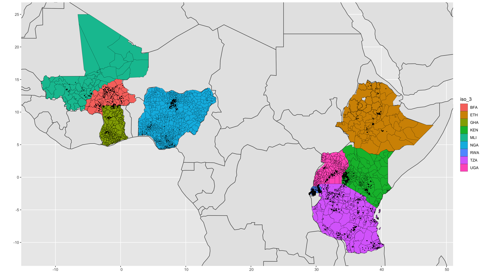

This notebook is an exploration of land size distributions
in household survey data. I begin by assessing the data
we have available, looking specifically at number of samples,
spatial coverage and completeness. I then explore the data on 
land-size. I explain why land size might be an interesting
variable to explore. Finally I delve into the distributions 
of land size in different locations.

## Primary Questions

* Why could land size be an important variable to investigate?
* People have traditionally mapped mean farm-size, is this helpful?
* What do land size distributions look like in different locations
* Can we interactively plot the conditional distribution of land-size, given parameters in a given location?
* If so, can we combine this with census data to answer the question: _based on the data we have, we think there are N farmers with farm-sizes under X ha, with confidence y_
* How would we validate such a model?


```{r setup, warning=F, message=FALSE,  echo=F}
knitr::opts_chunk$set(warning = FALSE, message = FALSE) 
# Data Processing Packages
library(jsonlite)
library(readr)
library(dplyr)
library(tibble)
library(rlang)

# Spatial Packages
library(sf)
library(sp)
library(stars)

# Plotting Packages
library(corrplot)
library(ggplot2)
library(ggridges)
library(ggExtra)
library(leaflet)
library(mapview)

# Statistical Analysis Pakcages
library(FactoMineR) # Package for dimensionality reduction
library(factoextra) # Package for dimensionality reduction
library(brms) # Bayesian analysis package
library(rstan) # R package for writing stan models
library(lme4) # Linear, generalised linear, and nonlinear mixed models
library(mgcv) # Package for GAMs
library(lqmm) # Linear Quatile Mixed Models (Hierarchical Quantile)
library(quantreg) # Quantile Regression
library(bamlss) # Bayesian Additive Models for Location Scale and Shape
library(moments) # Package for skewness
library(sn) # Function for generating data from a skew normal distribution
library(s2)
library(PerformanceAnalytics) # Library for plotting density and correlations

sf_use_s2(FALSE)

firstup <- function(x) {
  substr(x, 1, 1) <- toupper(substr(x, 1, 1))
  x
}

bin_and_quantile <- function(dat, bin_number, column){
  
  quantiles <- quantile(dat[column], seq(0,1,1/bin_number), na.rm=T)
  
  x_gt_cond <- quantiles[1:(length(quantiles)-1)]
  x_ls_cond <- quantiles[2:length(quantiles)]
  x_quarts <- paste0("q",c(1:bin_number))
  middles <- (x_gt_cond + x_ls_cond)/2
  cases <- paste0(column,' >= ', x_gt_cond, ' &', column ,'< ', x_ls_cond, ' ~ "', x_quarts, '"')
  cases[length(cases)] <- gsub("<", "<=", cases[length(cases)])
  
  
  dat <- dat %>% mutate(quantiles = dplyr::case_when(!!!rlang::parse_exprs(cases)))
  
  conversion_table <- tibble::as_tibble(
    list(
      quantile_name = x_quarts,
      quantile_center = as.numeric(middles)
    )
  )
  
  dat <- dat %>% left_join(conversion_table, by = c("quantiles"="quantile_name"))
  dat$quantiles <- factor(dat$quantiles, levels=x_quarts, ordered=T)
  
  
  return(dat)
  
}

```


```{r load_data,  echo=F}


rhomis_df <- readr::read_csv("./data/prepared-data/rhomis-geo-data.csv")

# Here we create a "geographic copy" of the dataset
rhomis_geo_data <- sf::st_as_sf(x = rhomis_df, wkt = "geometry")
rhomis_geo_data <- rhomis_geo_data[rhomis_geo_data$iso_3!="NER",]
sf::st_crs(rhomis_geo_data) <- "+proj=longlat +datum=WGS84 +no_defs +ellps=WGS84 +towgs84=0,0,0" 


# IPUMS GEO2 level dataset
ipums_df <- readr::read_csv("./data/prepared-data/ipums-all.csv")
ipums_geo <- sf::st_as_sf(x = ipums_df, wkt = "geometry")
ipums_geo <- ipums_geo[ipums_geo$iso_3!="NER",]
sf::st_crs(ipums_geo) <- "+proj=longlat +datum=WGS84 +no_defs +ellps=WGS84 +towgs84=0,0,0" 
ipums_geo$geometry <- ipums_geo$geometry %>% 
# s2::s2_rebuild() %>%
  sf::st_simplify(dTolerance = 0.05)
# lsms_all <- readr::read_csv("./data/prepared-data/lsms-all.csv")

# There are a lot of variables to examine in the dataset, 
# in this file we have organised them into categories
variable_categories <- jsonlite::read_json("./data/variable-categorisation.json")


world_all <- readr::read_csv("./data/prepared-data/world-shapefile.csv")
world_all <- sf::st_as_sf(x = world_all, wkt = "geometry")
# Metadata
pop_data <- readr::read_csv("./data/pop_variables.csv")
raster_data <- readr::read_csv("./data/raster_variables.csv")


modis_land_cover <- readr::read_csv("./data/earth-engine/modis_land_cover/land_cover_per_region_ipums.csv")

```


```{r PPP,   echo=F}

#There are many indicators in the RHoMIS dataset, however, we might want to
#compute some further indicators.

#All of the income units come in local currency units. I would like currencies to
#be internationally comparable, so I am going to change them to PPP$ (purchasing
#power parity).

income_columns_lcu <- c(
  "crop_income_lcu_per_year",
  "livestock_income_lcu_per_year",
  "total_income_lcu_per_year",
  "off_farm_income_lcu_per_year",
  "value_crop_consumed_lcu_per_hh_per_year",
  "value_livestock_products_consumed_lcu_per_hh_per_year",
  "value_farm_products_consumed_lcu_per_hh_per_year"
)
income_columns_ppp <- gsub("lcu", "ppp", income_columns_lcu)
rhomis_df[income_columns_ppp] <- rhomis_df[income_columns_lcu]/rhomis_df$currency_conversion_lcu_to_ppp

# Population columns came in form of totals
# Convert these into percentages for comparison
# between locations

population_columns_percentage <- paste0(
  variable_categories$ipums$population_columns,
  "_perc"
)

ipums_df[population_columns_percentage] <- 100*ipums_df[unlist(variable_categories$ipums$population_columns)]/ipums_df$TOTPOP_GEO2A

rhomis_df[population_columns_percentage] <- 100*rhomis_df[unlist(variable_categories$ipums$population_columns)]/rhomis_df$TOTPOP_GEO2A


# There are duplicate GEOID's by country, so need to create country specific IDs

ipums_df$GEOID_country <- paste0(ipums_df$GEOID, "_" ,ipums_df$iso_2)
rhomis_df$GEOID_country <- paste0(rhomis_df$GEOID, "_" ,rhomis_df$iso_2)


# It can be useful, for exploration, to understand the 
# different countries by region. 

region_table <- tibble::as_tibble(
  list(
    "iso_2"=c("BF", 
              "ET", 
              "GH", 
              "KE",
              "ML",
              "NG",
              "RW",
              "TZ",
              "UG"),
    "region_afr"=c("west_africa",
                   "east_africa", 
                   "west_africa", 
                   "east_africa", 
                   "west_africa",
                   "west_africa",
                   "central_africa",
                   "east_africa",
                   "east_africa"
                   
                   
    )
  )
)

ipums_df <- ipums_df %>% left_join(region_table, by = "iso_2")
rhomis_df <- rhomis_df %>% left_join(region_table, by = "iso_2")


```


## Assessing Data Coverage and Completeness

We are interested in the distribution 
of farm characteristics at the subnational level. 
First we need to check how much data we have in 
different subnational areas, and whether we potentially 
have sufficient data per area to plot a distribution.


``` {r leaflet_map, echo=F, fig.align="center"}


mapviewOptions(fgb = FALSE) # needed when creating web pages
# mapview(ipums_geo,fgb = FALSE, basemaps="OpenStreetMap.Mapnik")

map <- mapview(rhomis_geo_data$geometry, alpha=0.5, col.regions="black",color="white", burst=T)+
 mapview(ipums_geo$geometry, 
               alpha=1, 
               color="black", 
               col.regions = "green", 
               alpha.regions=0.3, burst=T)


map


```


``` {r plot_map,echo=F, eval=F}
# ggplot() +
#   geom_sf(data=world_all, size=0.5) +
#   geom_sf(data=ipums_geo, color="black", size=0.1,aes(fill=iso_3))  +
#   geom_sf(data=rhomis_geo_data, size=0.1) +
#   coord_sf(xlim = c(bounding_box$xmin, bounding_box$xmax), ylim = c(bounding_box$ymin, bounding_box$ymax))
```
<!--  -->

For this study, we are interested in areas where we have household survey
data and external datasets (census, climate, and land coverage).
There are 9 countries which fulfill these criteria. 

If we look at the number of surveys per country, there are three candidates from 
the datasets which have helpful characteristics:

1. They have a relatively large number of surveys (n>2000)
2. They have surveys in a significant portion of their subnational areas (>40%)

The three countries are Burkina Faso (West Africa), Rwanda (Central Africa), and Tanzania (East Africa).

```{r, echo=F, fig.align='center', fig.show="hold", out.width="50%"}
par(mar = c(4, 4, .1, .1))

households_per_country <- rhomis_df %>% 
  filter(!is.na(iso_2)) %>% 
  group_by(iso_2) %>% 
  summarise(
    number_of_households=dplyr::n()
  )

households_per_country <- households_per_country %>% left_join(region_table, by="iso_2")


ggplot(households_per_country, aes(x=iso_2, y=number_of_households, fill=region_afr))+
  geom_bar(stat="identity")+
  labs(title="Number of RHoMIS Surveys by Country",
       x ="ISO Country Code", y = "Number RHoMIS Surveys")


areas_in_rhomis <- ipums_df %>% 
  # Select columns
  select(c("iso_2", "GEOID_country", "GEO2LABEL")) %>% 
  # Add a True/False column, whether the GEOID is in RHoMIS
  mutate(
    in_rhomis = ipums_df$GEOID_country %in% rhomis_df$GEOID_country,
  ) %>% 
  group_by(iso_2) %>% 
  # Get the country summary of number of areas, and nuber of rhomis areas
  summarise(
    number_of_GEO2=dplyr::n(),
    GEO2_with_rhomis=sum(in_rhomis==T)
  ) %>% 
  # Calculate the percentage of areas covered
  mutate(
    coverage = 100*GEO2_with_rhomis/number_of_GEO2,
  )


areas_in_rhomis <- areas_in_rhomis %>% left_join(region_table, by="iso_2")


ggplot(areas_in_rhomis, aes(x=iso_2, y=coverage, fill=region_afr))+
  geom_bar(stat="identity")+
  labs(title="Percentage of GEO2 Areas Containing RHoMIS Surveys",
       x ="ISO Country Code", y = "Percentage of Areas with RHoMIS Surveys")


# knitr::kable(areas_in_rhomis)

# stats_per_area <- rhomis_df %>% 
#   group_by(iso_2, GEO2LABEL) %>% 
#   summarise(
#     households_per_area=dplyr::n()
#   ) %>% 
#   group_by(iso_2) %>% 
#   summarise(
#     hh_per_geo2_mean=mean(households_per_area),
#     hh_per_geo2_lq=quantile(households_per_area, 0.25, na.rm=T),
#     hh_per_geo2_median=quantile(households_per_area, 0.5, na.rm=T),
#     hh_per_geo2_uq=quantile(households_per_area, 0.75, na.rm=T),
#     hh_per_geo2_iqr=IQR(households_per_area, 0.75, na.rm=T),
# 
#     hh_per_geo2_sd=sd(households_per_area)
# 
#   )

stats_per_area <- rhomis_df %>% 
  filter(!is.na(iso_2))%>% 
  group_by(iso_2, GEO2LABEL) %>% 
  summarise(
    households_per_area=dplyr::n()
  ) 

stats_per_area <- stats_per_area %>% left_join(region_table, by="iso_2")


ggplot(stats_per_area, aes(x=iso_2, y=households_per_area, fill=region_afr))+
  geom_boxplot()+
  labs(title="Number of RHoMIS Surveys in GEO2 Households",
       x ="ISO Country Code", y = "Number of Households in Area")


```


# Why Land Size

In this study, we are interested in looking 
at Land Size. Land size is an interesting 
variable to look at for smallholder farmers. It can tell us a lot about other 
variables (some of which are more error 
prone, or more difficult to measure e.g. income and food security).

If we plot land size directly against income and food security, it can be 
difficult to see the relationship due to outliers and high variation.
However if we look at quantiles and distributions, we can begin to 
see that there might be some sort of association. We see that 
there might be some relationship
between land size and total income, food security, 
and livestock holdings.

Interestingly we see that the spread varies for 
different quantiles. For example, for higher land sizes, we 
see a larger spread in income values.


```{r land_size_1, fig.align='center', echo=F}

rhomis_no_na <- rhomis_df %>% 
  filter(!is.na(iso_2)) %>% 
  filter(!is.na(land_cultivated_ha)) 

rhomis_no_na <- bin_and_quantile(rhomis_no_na, 10, "land_cultivated_ha")
rhomis_no_na <- rhomis_no_na %>% rename(land_quantiles=quantiles)
rhomis_no_na <- rhomis_no_na %>% rename(land_quantile_centers=quantile_center)


ggplot(rhomis_no_na, aes(x=land_quantiles, y=total_income_ppp_per_year)) +
  geom_boxplot()+
  scale_y_continuous(limits = quantile(rhomis_no_na$total_income_ppp_per_year, c(0, 0.8), na.rm = T))+
  labs(title="Total Income for 10 Land Size Quantiles",
       x ="Land Size Quantile", y = "Total Household Income (PPP$/Year)")

ggplot(rhomis_no_na, aes(x=land_quantiles, y=fies_score)) +
  geom_boxplot()+
  scale_y_continuous(limits = quantile(rhomis_no_na$fies_score, c(0, 0.9), na.rm = T))+
  labs(title="Food Security Score for 10 Land Size Quantiles",
       x ="Land Size Quantile", y = "FIES Score")


rhomis_no_na$livestock_tlu[rhomis_no_na$livestock_tlu<0] <- NA
ggplot(rhomis_no_na, aes(x=land_quantiles, y=livestock_tlu)) +
  geom_boxplot()+
  scale_y_continuous(limits = quantile(rhomis_no_na$livestock_tlu, c(0, 0.9), na.rm = T))+
  labs(title="Livestock TLU for 10 Land Size Quantiles",
       x ="Land Size Quantile", y = "Livestock TLU")

```


## Why Map the Spread of Land Sizes

In mapping efforts, we often see researchers trying to map
averages. For example, in  the 
[Lowder](https://www.sciencedirect.com/science/article/pii/S0305750X15002703)
article, they mapped average farm size per subnational unit using
census information, and information on the total arable land. 

In different areas however, there is a large variation in 
land sizes. Here we see that we have a wide range of land size distributions,
each of which vary quite significantly by country.


```{r land_size_2, fig.align='center', echo=F}


ggplot(rhomis_no_na, aes(x=iso_2, y=land_cultivated_ha, fill=region_afr))+
  geom_boxplot()+
  scale_y_continuous(limits = quantile(rhomis_df$land_cultivated_ha, c(0, 0.95), na.rm = T))+
  labs(title="Land Cultivated (ha) per Country",
       x ="ISO Country Code", y = "Land Cultivated (ha)")


```


If we were to use land size to prioritise
development interventions, it would be important 
to account for the characteristics of land size 
distributions.

In the plots below, we can see there appears to be an association between
average (mean or median) land cultivated, and 
the spread of land cultivated (sd or IQR). This
relationship appears to be heteroskedastic. For areas
with larger average cultivated land, there is also a 
greater spread (i.e. different households cultivating
different land sizes).

We also see that for most subnational 
areas, Land Size distributions are skewed,
and in many of these areas the distributions
are fat-tailed (normal distribution has 
kurtosis of ~ 3).

```{r land_size_3, fig.align='center', echo=F}


land_size_stats <- rhomis_no_na %>% 
  group_by(GEOID_country) %>% 
  summarise(
    mean_land_cultivated_ha = mean(land_cultivated_ha, na.rm=T),
    sd_land_cultivated_ha = stats::sd(land_cultivated_ha, na.rm=T),
    median_land_cultivated_ha = median(land_cultivated_ha, na.rm=T),
    iqr_land_cultivated_ha = IQR(land_cultivated_ha, na.rm=T),
    
    skew_land_cultivated_ha = moments::skewness(land_cultivated_ha, na.rm=T),
    kurtosis_land_cultivated_ha = moments::kurtosis(land_cultivated_ha, na.rm=T)
  )

land_size_stats <- land_size_stats %>% left_join(unique(rhomis_no_na[c("iso_2","GEOID_country","region_afr" )]), by="GEOID_country")


ggplot(land_size_stats, aes(x=mean_land_cultivated_ha, y=sd_land_cultivated_ha, color=region_afr))+
  geom_point()+
  scale_y_continuous(limits = quantile(land_size_stats$sd_land_cultivated_ha, c(0, 0.95), na.rm = T))+
  scale_x_continuous(limits = quantile(land_size_stats$mean_land_cultivated_ha, c(0, 0.95), na.rm = T))+
  labs(title="Mean Land Cultivated vs Std Dev Land Cultivated\nper GEOID (Subnational Level 2)",
       x ="Mean Land Cultivated (ha)", y = "Std Dev Land Cultivated", color="Country")


ggplot(land_size_stats, aes(x=median_land_cultivated_ha, y=iqr_land_cultivated_ha, color=region_afr))+
  geom_point()+
  scale_y_continuous(limits = quantile(land_size_stats$iqr_land_cultivated_ha, c(0, 0.95), na.rm = T))+
  scale_x_continuous(limits = quantile(land_size_stats$median_land_cultivated_ha, c(0, 0.95), na.rm = T))+
  labs(title="Median Cultivated vs IQR Land Cultivated\nper GEOID (Subnational Level 2)",
       x ="Median Land Cultivated (ha)", y = "IQR Land Cultivated", color="Country")


ggplot(land_size_stats, aes(x=skew_land_cultivated_ha))+
  geom_histogram(fill="dodgerblue4", color="black", size=0.5)+
  scale_x_continuous(limits = quantile(land_size_stats$skew_land_cultivated_ha, c(0, 0.95), na.rm = T))+
  labs(title="Skewness of Land Cultivated per GEOID",
       x ="Skewness", y = "Frequency")

ggplot(land_size_stats, aes(x=kurtosis_land_cultivated_ha))+
  geom_histogram(fill="dodgerblue4", color="black", size=0.5)+
  scale_x_continuous(limits = quantile(land_size_stats$kurtosis_land_cultivated_ha, c(0, 0.95), na.rm = T))+
  labs(title="Kurtosis of Land Cultivated per GEOID",
       x ="Kurtosis", y = "Frequency")


```


What do these distributions this mean in practice. Lets 
say we are using Land Size to target 
development interventions towards the poorest of the poor.

We could target interventions based on mean land cultivated.
i.e, we make the assumption lower mean land cultivated means
more people with smaller farms. People with smaller farms have lower incomes 
or food security status.

Let us see what this would look like with the data we have. If
we were to take a threshold value, say we are interested
in households farming less that 2 hectares. What we would see is that
the spread can vary quite significantly, depending on the 
location we are looking at. For example, in areas where the mean land cultivated
is about 1.8ha, the proportion of households cultivating
less than 2ha can vary from about 35% to 100%.

In large scale surveys, it is much more difficult to see this type
of small-scale variation, as often only a few households are sampled
in these subnational areas. 


``` {r mean_vs_threshold, echo=F, fig.align='center'}


mean_vs_threshold <- rhomis_no_na %>% 
  filter(land_cultivated_ha < quantile(land_cultivated_ha, 0.95, na.rm=T)) %>% 
  group_by(GEOID_country) %>% 
  summarise(
    mean_land_cultivated = mean(land_cultivated_ha, na.rm=T),
    number_below_2_ha = sum(land_cultivated_ha<2),
    quantile_0.1 = quantile(land_cultivated_ha,0.1),
    
    number_of_hh = dplyr::n()) %>% 
  mutate(
    proportion_below_threshold = number_below_2_ha/number_of_hh,
  )

mean_vs_threshold <- mean_vs_threshold %>% left_join(unique(rhomis_no_na[c("iso_2","GEOID_country","region_afr" )]), by="GEOID_country")


mean_vs_threshold <- bin_and_quantile(mean_vs_threshold,5,"mean_land_cultivated")
mean_vs_threshold <- mean_vs_threshold %>% rename(mean_land_cultivated_quantiles=quantiles)
mean_vs_threshold <- mean_vs_threshold %>% rename(mean_land_cultivated_quantile_center=quantile_center)

mean_vs_threshold <- bin_and_quantile(mean_vs_threshold,5,"proportion_below_threshold")
mean_vs_threshold <- mean_vs_threshold %>% rename(proportion_below_threshold_quantiles=quantiles)
mean_vs_threshold <- mean_vs_threshold %>% rename(proportion_below_threshold_quantile_center=quantile_center)

mean_vs_threshold <- mean_vs_threshold[complete.cases(mean_vs_threshold),]


# subset <- mean_vs_threshold[mean_vs_threshold$mean_land_cultivated_quantile_center <quantile(mean_vs_threshold$mean_land_cultivated, 0.95, na.rm = T),]


# ggplot(
#   subset, 
#   aes(x=mean_land_cultivated,y=proportion_below_threshold_quantile_center, group=proportion_below_threshold_quantile_center, color=region_afr))+
#        stat_density_ridges(bandwidth = 1, quantiles = 4) +
#     geom_point(data=subset, aes(x=mean_land_cultivated, y=proportion_below_threshold))+
# 
#    coord_flip() +
# 
#   labs(title="Mean Land Cultivated vs Prop of Households with <2ha of Land",
#          x ="Mean Land Cultivated", y = "Proportion of Households <2ha")


ggplot(
  mean_vs_threshold, 
  aes(x=proportion_below_threshold,y=mean_land_cultivated_quantile_center, group=mean_land_cultivated_quantile_center, color=region_afr))+
  stat_density_ridges(bandwidth = 0.07, 
                      scale = 0.5, 
                      size = 0.25, 
                      rel_min_height = 0.04
  ) +
  geom_point(data=mean_vs_threshold, aes(y=mean_land_cultivated, x=proportion_below_threshold))+
  geom_smooth(data=mean_vs_threshold, method="lm", aes(y=mean_land_cultivated, x=proportion_below_threshold, group=NULL, color=NULL))+
  
  coord_flip() +
  
  labs(title="Mean Land Cultivated vs Prop of Households with <2ha of Land",
       y ="Mean Land Cultivated", x = "Proportion of Households <2ha")


ggplot(mean_vs_threshold, aes(x=mean_land_cultivated, y=quantile_0.1, color=region_afr))+
  geom_point() +
  geom_smooth(method="lm")+
  # scale_y_continuous(limits =  c(0, 1))+
  scale_x_continuous(limits = quantile(mean_vs_threshold$mean_land_cultivated, c(0, 0.95), na.rm = T))+
  labs(title="Mean Land Cultivated vs Quantile 0.1 (lowest 10%)",
       x ="Mean Land Cultivated", y = "10th Quantile")


```


## Covariates

It is clear from an initial exploration
that there is more going on at the subnational
level than variation in the mean. In this study
we want to see if we can try to predict this 
this variation. 

To predict characteristics of subnational 
heterogneity, we need data at the subnational level. 

For this study we have aggregated census data (GEO2 level),
climate data, and land-cover information. Here are the variables we have


```{r variable_desc, echo=F}

pop_data 

raster_data


```

We don't have all of these variables for all of these 
subnational levels. So let's see what we do have

``` {r covariate_coverage, echo=F}

ipums_df %>%
  filter(GEOID_country %in% rhomis_no_na$GEOID_country ) %>%
  group_by(iso_2) %>%
  summarise(across(.cols = everything(), ~100*sum(is.na(.))/length(.))) %>%
  select_if(function(col) any(col >0)) %>%
  rowwise() %>%
  select_if(function(row) any(row >0))


```

From this assessment of data completeness, it seems that
covariates are not available in the Nigeria data. There is 
one region in Kenya where covariates are not available. 

There is missing data on Agricultural Employment in Nigeria,
Kenya, Burkina Faso, and Ethiopia. Missing data on "telephone"
in Nigeria, Kenya, and Mali. Missing data on "toilet" in
Kenya and Nigeria.


``` {r pca_covariates, echo=F,eval=F}

vars <- c("barren",
          "closed_shrublands",
          "cropland_natural_vegetation_mosaic",
          "croplands",
          "deciduous_broad_leaf",
          "deciduous_needle_leaf",
          "evergreen_broad_leaf",
          "evergreen_needle_leaf",
          "grass_lands",
          "mixed_forest",
          "open_shrublands",
          "permanent_snow",
          "savanas",
          "urban",
          "water_bodies",
          "wetlands",
          "woody_savanas")

# for (var in vars)


for (var in vars){
  
  
  var_pretty <- firstup(var)
  var_pretty <- gsub("_", " ", var_pretty)
  
  # summary <- modis_land_cover %>% 
  #   group_by(iso_2) %>% 
  #   summarise(
  #     variable = mean(get(var), na.rm=T)
  #   )
  
  # ggplot(summary, aes(x=iso_2, y=variable))+
  #   geom_bar(stat="identity") +
  #   labs(title=paste0(var_pretty, " Pixel Coverage by Country"),
  #        x ="ISO Country Code", y = paste0("Proportion of ",var_pretty, " Pixels Covered"))
  
  plot <- ggplot(modis_land_cover, aes(x=iso_2, y=get(var)))+
    geom_boxplot() +
    scale_y_continuous(limits = quantile(modis_land_cover[var], c(0, 0.9), na.rm = T))+  
    labs(title=paste0(var_pretty, " Pixel Coverage by Country"),
         x ="ISO Country Code", y = paste0("Proportion of ",var_pretty, " Pixels Covered"))
  
  ggsave( paste0("./outputs/earth-engine/", var,"_boxplot.png"),plot)
}


pca_data <- modis_land_cover[vars]

chart.Correlation(pca_data, histogram=TRUE, pch=19)


 res.pca <- FactoMineR::PCA(pca_data, ncp=20)

 res.pca$eig


 fviz_screeplot(res.pca, ncp=20)
 fviz_pca_var(res.pca)


```


## Modelling Location Scale and Shape

In distributional models, 

## Notes

This exploration is a step towards developing 
procedures to map smallholder heterogeneity. I 
do not want to imply that mapping land size is
the only thing we need to do for targetting 
the "poorest of the poor". 

``` {r skew_normal_example, echo=F}

# set.seed(42)
# 
# # xi = location
# # omega = scale
# # alpha = shape
# skew_normal_values <- rsn(n=10000, 
#                        xi = 2,
#                        omega=2,
#                        alpha=5)
# skew_normal_values<- skew_normal_values[skew_normal_values>0]
# skew_normal_values <- tibble::as_tibble(list(
#   values=skew_normal_values
# ))
# 
# normal_values <- rsn(n=10000, 
#                        xi = 2,
#                        omega=2,
#                        alpha=0)
# normal_values<- normal_values[normal_values>0]
# normal_values <- tibble::as_tibble(list(
#   values=normal_values
# ))
# 
# 
# 
# ggplot(skew_normal_values,aes(x=values)) +
#   geom_histogram() +
#   geom_density()
# 
# ggplot(normal_values,aes(x=values)) +
#   geom_histogram() +
#   geom_density()
# 
# skewed_normal <-  function(
    #       x,
#       omega,
#       phi,
#       location
#     )
# 
# y = (1/(2*pi))*exp()
# 

```


# Subnational Level Covariates

```{r ipums_cov, fig.align='center', echo=F, eval=F}


# pca_data <- ipums_df[
#       c(unlist(variable_categories$ipums$economic_subnational_indicators),
#     unlist(variable_categories$ipums$population_columns_percentage),
#     unlist(variable_categories$ipums$employment_columns),
#     unlist(variable_categories$ipums$landscape_variables))
#   
#   ]

#chart.Correlation(pca_data, histogram=TRUE, pch=19)


# res.pca <- FactoMineR::PCA(pca_data, ncp=20)

# res.pca$eig


# fviz_screeplot(res.pca, ncp=20)
# fviz_pca_var(res.pca)


```


```{r gam_attempt, echo=F, eval=F}


# fit_zinb2 <- brms::brm(
#   bf(land_cultivated_ha ~ ELECTRICITY_GEO2A, alpha ~ ELECTRICITY_GEO2A),
#                  data = rhomis_df, family = skew_normal())
# summary(fit_zinb2)

y <- "land_cultivated_ha"
sep <- "~"


dep_vars <- paste0(c(
  unlist(variable_categories$ipums$economic_subnational_indicators),
  unlist(variable_categories$ipums$population_columns_percentage),
  unlist(variable_categories$ipums$employment_columns),
  unlist(variable_categories$ipums$landscape_variables)
), collapse=") + s(")
dep_vars <- paste0("s(",dep_vars,")")

formula <- as.formula(paste0(y, sep, dep_vars, collapse = " "))

# my_gam <- mgcv::gam(
#   data=rhomis_df,
#   formula = formula,
#   method="REML")
# summary(my_gam)
# gam.check(my_gam)
# 
# plot(my_gam)


```