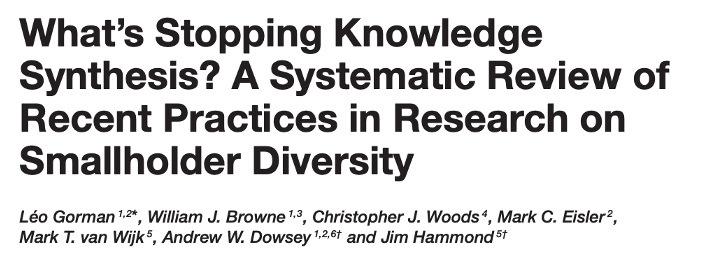
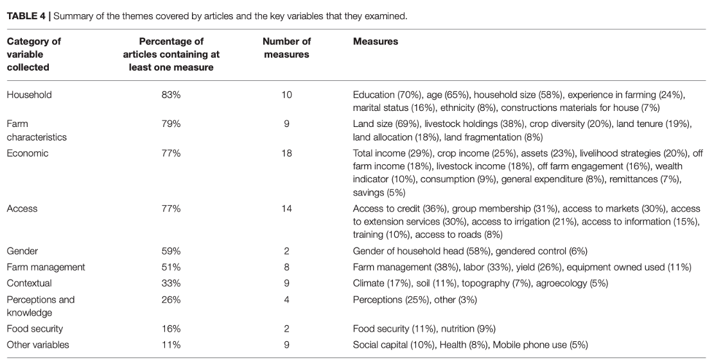
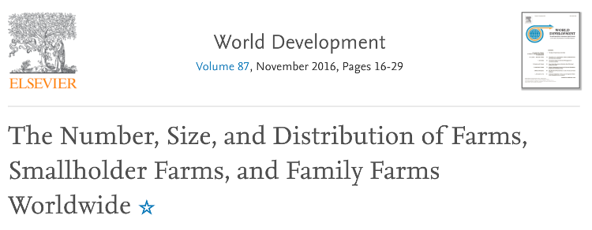

```{r setup, include=FALSE}

knitr::opts_chunk$set(echo = TRUE)

```


# What is Heterogeneity


{width=400px}
{width=600px}

## Why do We Care? 

<div class="container">

<div class="col quote-box">
<small>"In recent years, many studies have demonstrated the heterogeneity of the smallholder production environment. Yet agronomic research for development (R4D) that aims to identify and test options for increasing productivity has not consistently adapted its approaches to such heterogeneous conditions."
</small>


</div>


<div class="col">
  {width=400px}
</div>
</div>


## Why do We Care? 

<div class="container">

<div class="col quote-box">
<small>"IFAD’s comparative advantage lies in its targeting of the poorest, the poor and the vulnerable peoples and those who are most likely to have little access to assets and opportunities due to social exclusion and marginalization"
</small>

<small><i>Article 5</i></small>

<!-- <div class="quote-container"> -->
<!-- <small class="d-flex justify-content-end">sezdrgfsezrsfd</small> -->
<!-- </div> -->

</div>

<div class="col">
  {width=400px}
</div>
</div>

## Why do We Care? 

<div class="container">

<div class="col">
<small>"… Member States indicated that they will seek to increase and use high-quality, timely and reliable data disaggregated by sex, age, geography, income, race, ethnicity, migratory status, disability and other characteristics relevant in national contexts"
</small>

<small><i>General Assembly resolution 69/313</i></small>

<!-- <div class="quote-container"> -->
<!-- <small class="d-flex justify-content-end">sezdrgfsezrsfd</small> -->
<!-- </div> -->

</div>

<div class="col">
  {width=400px}
</div>
</div>


## Why do We Care? 

<div class="container">

<div class="col quote-box">
<small>"To target food security interventions for smallholder households, decision makers need large-scale information, such as <strong>maps on poverty, food security and key livelihood activities"</strong>
</small>

<!-- <div class="quote-container"> -->
<!-- <small class="d-flex justify-content-end">sezdrgfsezrsfd</small> -->
<!-- </div> -->

</div>


<div class="col">
  {width=400px}
</div>
</div>

## Why do We Care? 

<div class="container">

<div class="col quote-box">
<small>"...(farm size) estimates help inform agricultural development strategies, although the estimates are limited by the data available."
</small>


</div>


<div class="col">
  {width=400px}
</div>
</div>


# How do we Capture Heterogeneity (**Procedures**)


## Indirect Estimation 

<small>Using two or more known variables to 
estimate your target</small>

{width=400px}
  
<div class="flex-container">
<div class="col">

<h5>Advantages</h5>

<small>
<ul>
<li> Can produce estimates with large coverage  </li>
<li> Intuitive </li>
</ul>
</small>
</div>
<div class="col">

<h5>Disadvantages</h5>

<small>
<ul>
<li> Need assumptions about distribution of target </li>
<li> Limited to known close associations </li>
<li> Can reinforce existing assumptions when incorrect </li>
</ul>
</small>
</div>

</div>

## Household Level Estimates

<small>Using associations between household and/or
environmental characteristics to predict
household level outcomes</small>

{width=400px}
  
<div class="flex-container">
<div class="col">

<h5>Advantages</h5>

<small>
<ul>
<li> Can show drivers when explainable methods are used  </li>
<li> Can generate estimates with uncertainty </li>
</ul>
</small>
</div>
<div class="col">

<h5>Disadvantages</h5>

<small>
<ul>
<li> Until now, assumptions made about distribution </li>
<li> Outliers and significant local heterogeneity make it difficult to identify largescale variations </li>

</ul>
</small>
</div>

</div>

## Area Level Estimates

<small>Using associations between spatial indicators to predict
a statistic for an "area"</small>

{width=400px}
  
<div class="flex-container">
<div class="col">

<h5>Advantages</h5>

<small>
<ul>
<li> Can draw on data with large spatial coverage </li>
</ul>
</small>
</div>
<div class="col">

<h5>Disadvantages</h5>

<small>
<ul>
<li> Difficult to validate in applied setting </li>
<li> Local level heterogeneity often dominates </li>
<li> Obsession with the mean </li>
</ul>
</small>
</div>
</div>


## Clustering

<small>Identifying typologies by identifying 
multi-dimensional similarities</small>

{width=400px}
  
<div class="flex-container">
<div class="col">

<h5>Advantages</h5>

<small>
<ul>
<li> Could be used for intuitive groupings for field work </li>
<li> Flexible for manageable groupings </li>

</ul>
</small>
</div>
<div class="col">

<h5>Disadvantages</h5>

<small>
<ul>
<li> Focuses on single level similarities </li>
<li> Difficult to transfer </li>
<li> Interpretation of clusters could be subject to bias </li>
<li> In heterogeneous environments the "tightness" of the clusters can be questionable </li>

</ul>
</small>
</div>
</div>


## Interpolation

<small>Smoothing between points to 
"fill in the gaps"</small>

<div class="flex-container">
<div class="col">

<h5>Advantages</h5>

<small>
<ul>
<li> Intuitive </li>
<li> Can lead to predictions with large spatial coverage </li>
<li> Easy to transfer to temporal interpolations </li>

</ul>
</small>
</div>
<div class="col">

<h5>Disadvantages</h5>

<small>
<ul>
<li> Cannot deal with stepwise changes </li>
<li> Large uncertainties with patchy </li>
<li> No real explanation of the spatial variation </li>

</ul>
</small>
</div>
</div>


# What do We Need for Targetting?


<div class="flex-container">

<div class="col">
<h5>What Works?</h5>
<small>
<ul>
<li> Villages </li>
<li> Subnational units </li>
<li> Agro-ecological zones </li>
</ul>
</small>
</div>

<div class="col">

<h5>For Who?</h5>

<small>
<ul>
<li> Demographic groups </li>
<li> Wealth quartiles </li>
<li> Practices? </li>
<li> Villages </li>
<li> Subnational units </li>
<li> Agro-ecological zones </li>
</ul>
</small>
</div>


<div class="col">
<h5>Why?</h5>

<small>
<ul>
<li> Household demographics </li>
<li> Practices </li>
<li> Spatial drivers </li>
</ul>
</small>
</div>
</div>

* Traditional mapping and heterogeneoity efforts often *assume importance of particular variables*

# Initial Exploration


# Initial Correlations


# Typical Linear Regression Procedure


# Quantile 
